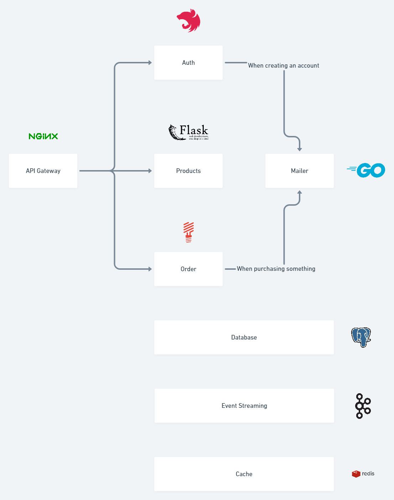

This is a short example about microservices built using programming-language-agnosticism or at least something like that.
The services are built and exposed individually and handled by Nginx performing an API Gateway.

<br />

# Install

Make sure to creates the network that'll be used through the docker application:

```
docker network create msnetwork
```

Then up and build the containers:

```
docker compose up --build
```
<br />

# Utilities addresses

[pgAdmin](http://localhost:5050) - To administrate Postgres database

[Redpanda Console](http://localhost:8080) - To see topics and messages

[MailHog](http://localhost:8025) - To receive email messages

<br />

